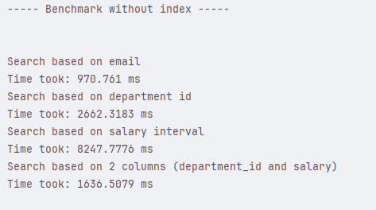
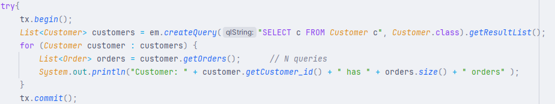
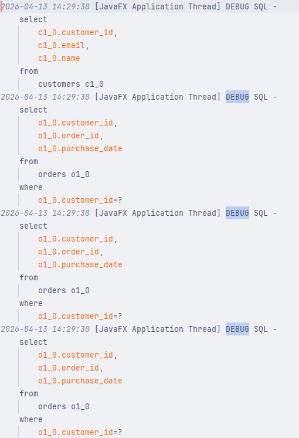
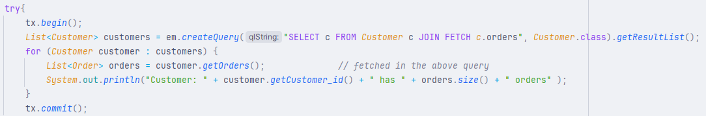
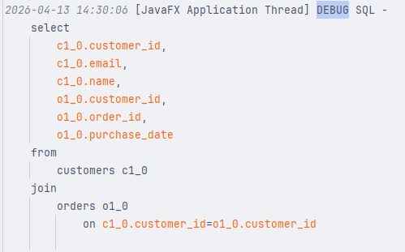

# Performance optimization project
I chose this project because I wanted to study the performance hits inside a database based on these scenarios: 
* How can indexes help in query optimization and performance.
* How paging with Limit/Offset and keyset can improve data fetching.
* How caching can boost performance inside java code using EhCache.
* How batching (on insert and update) reduces time complexity.

## Benchmarking with and without indexes

In this section my main focus was to showcase the importance of using indexes. While they can introduce extra space for storing the index and raise time complexity for inserting and updating (the database has to insert and update the indexes too, not only the database records), they speed up searching the database considerably. I worked on the Employees table with 10.000 records and dit 44 types of searches:
* Search by email
* Search by department_id
* Search by salary range
* Search by 2 columns

#### Here are the indexes i've created:

    

#### Here are the results:

    <h1><strong>Results without indexes:</strong></h1>
    
    <h1><strong>Results using indexes:</strong></h1>
    

## Paging (Limit/Offset and Keyset)

## The N + 1 problem

In this section I provided a demonstration of what happens if we don't use the Join Fetch instruction. 
* In the first example the query executes once, and for every .getOrders() method call inside the loop, the ORM has to create a new query. 
* In the second example the first query fetches all the orders inside the Customer object using the Left Join Fetch operation.

#### First example:

    <h1><strong>Code:</strong></h1>
    
    <h1><strong>Result:</strong></h1>
    

#### Second example:

    <h1><strong>Code:</strong></h1>
    
    <h1><strong>Result:</strong></h1>
    

We can see based on the result that the first approach generates N (size of the Customers table) more queries than the second because the orders were not saved inside the customer object from the first query. As a result to this we have to query the database for every customer just so we can get the respective orders. This introduces unnecessary complexity and overhead to the code. The fix to this is showcased on the second approach where we load the orders for every customer from the first instruction.   